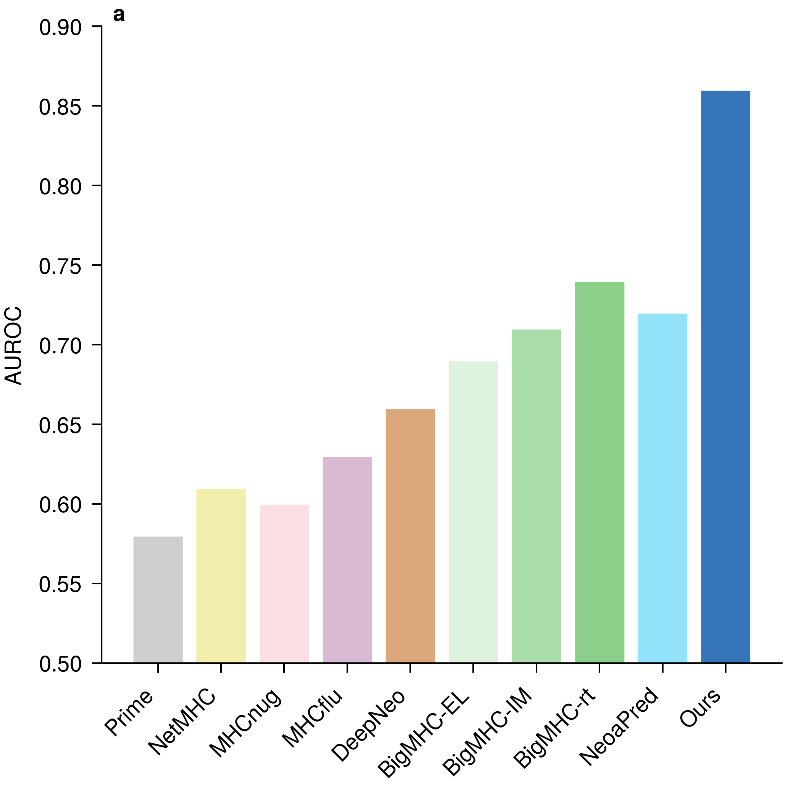
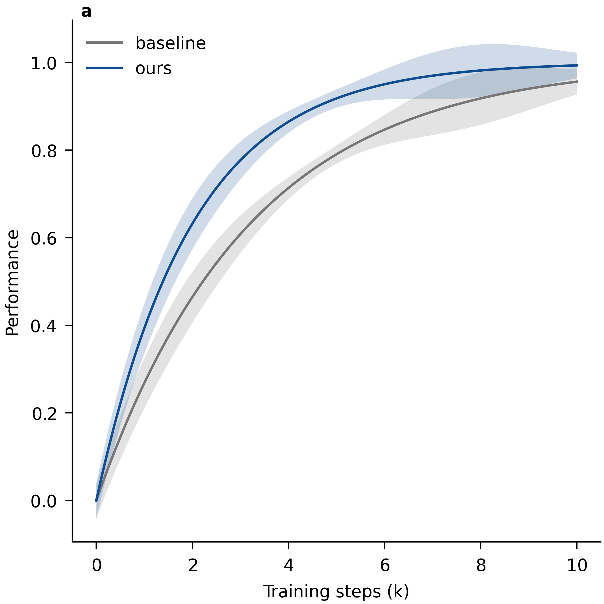
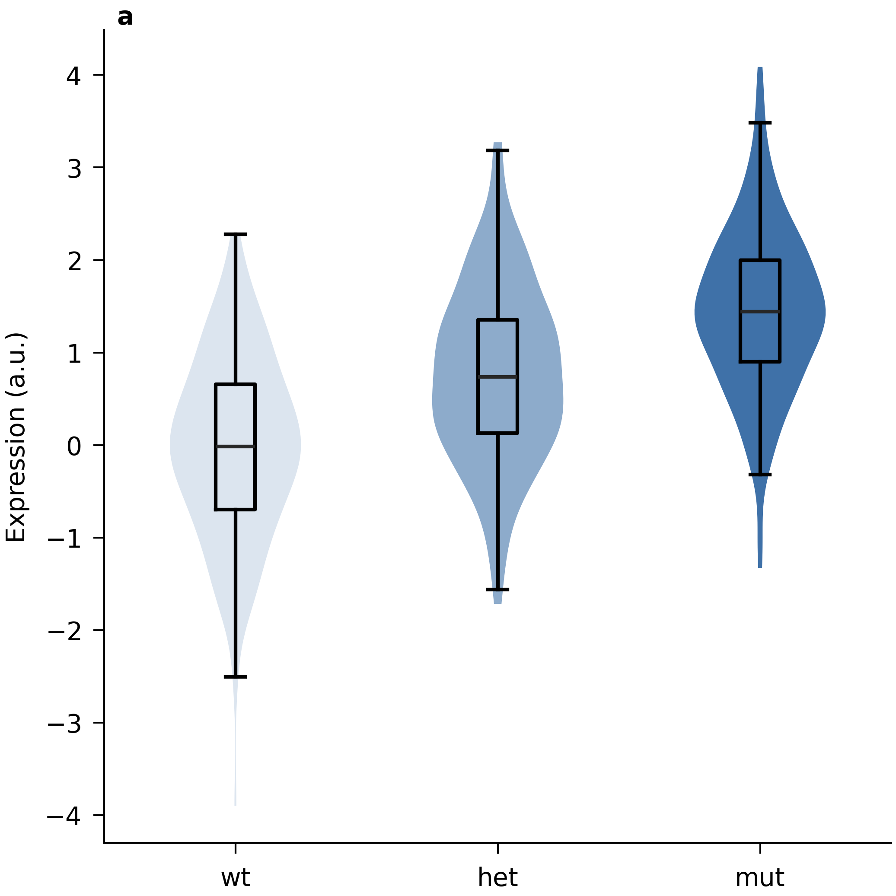
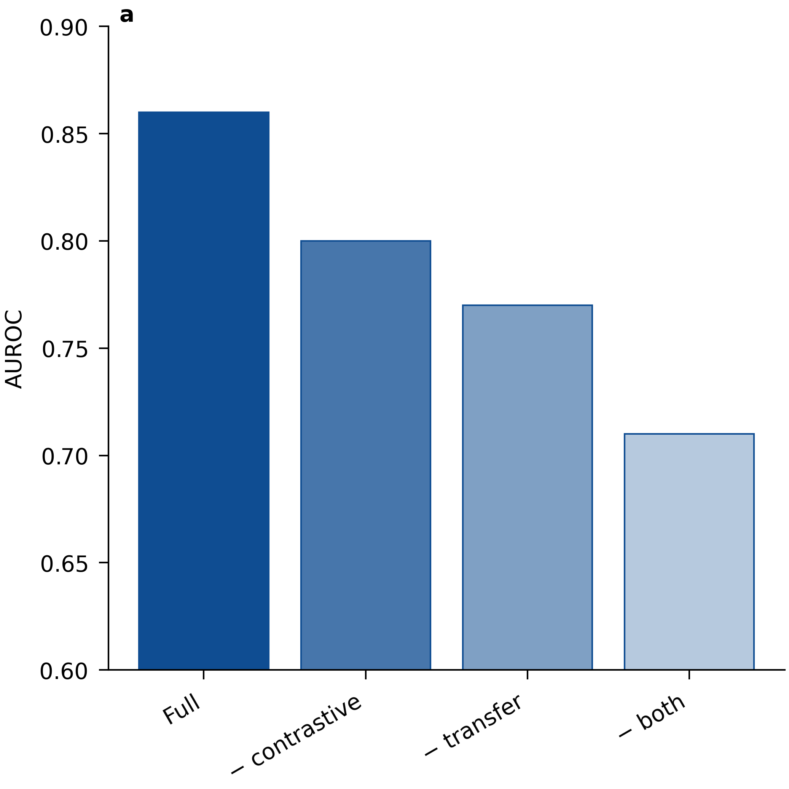
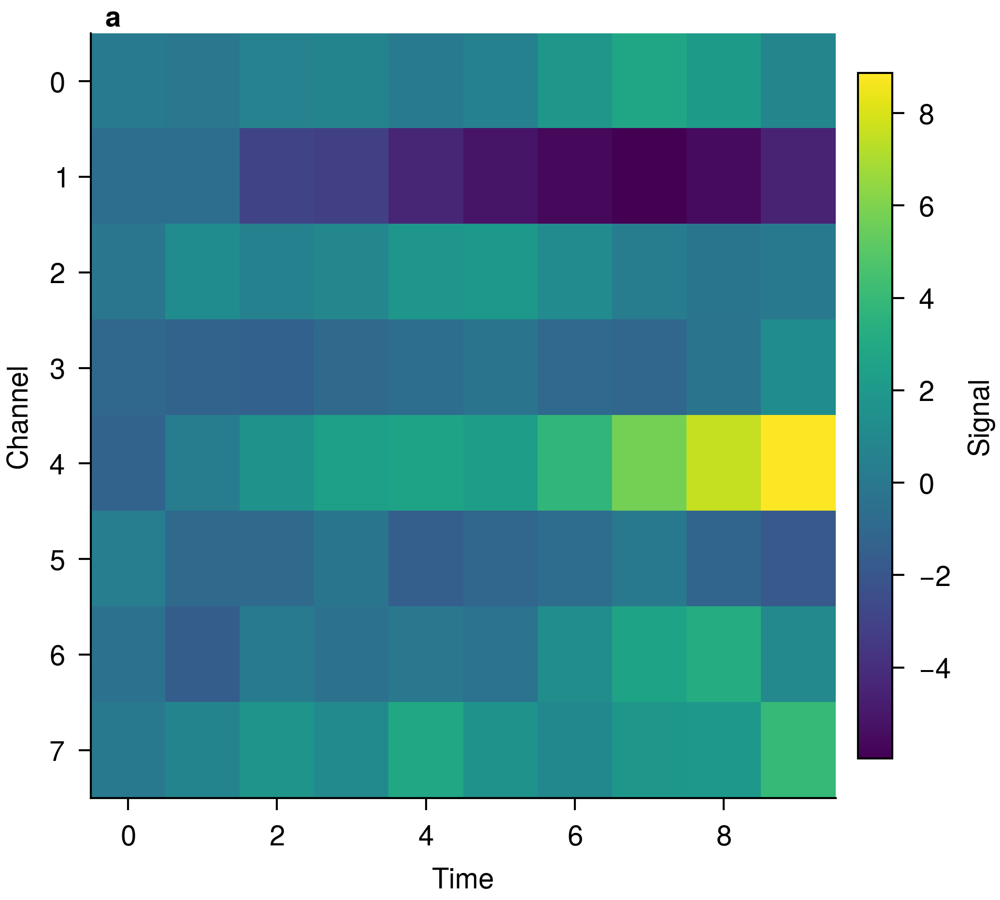
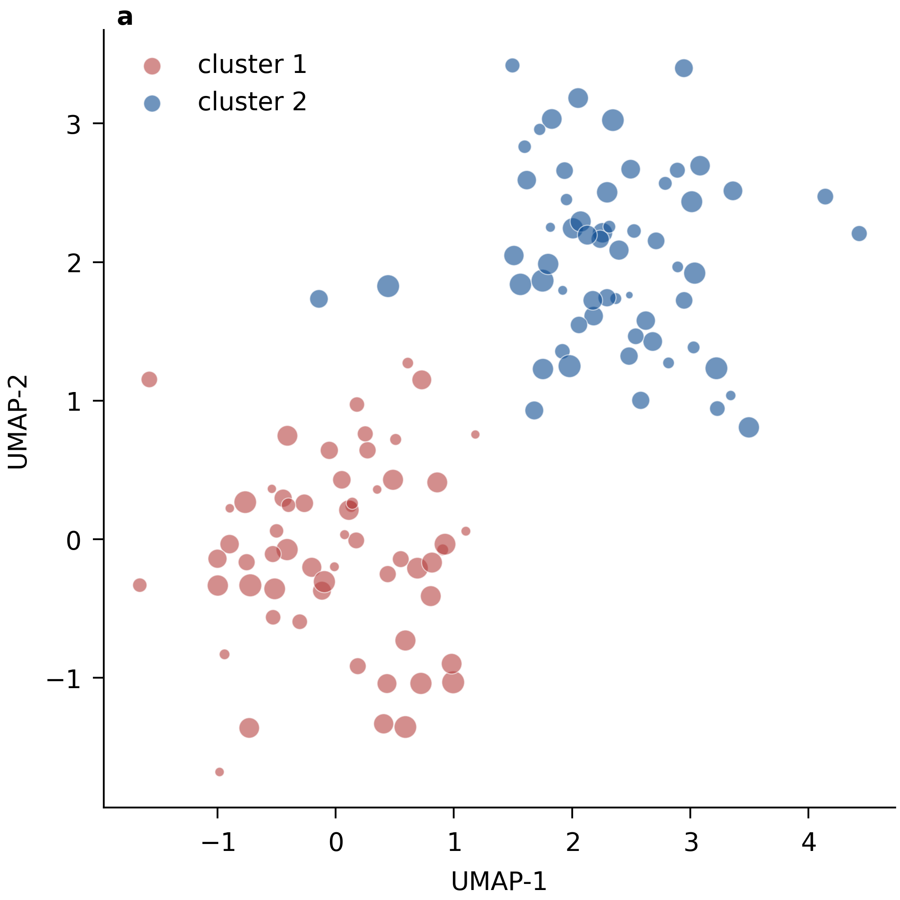
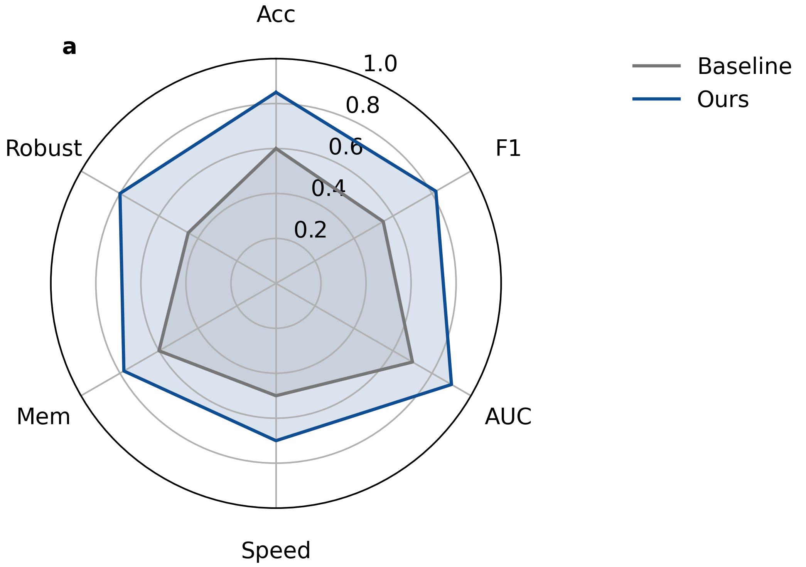
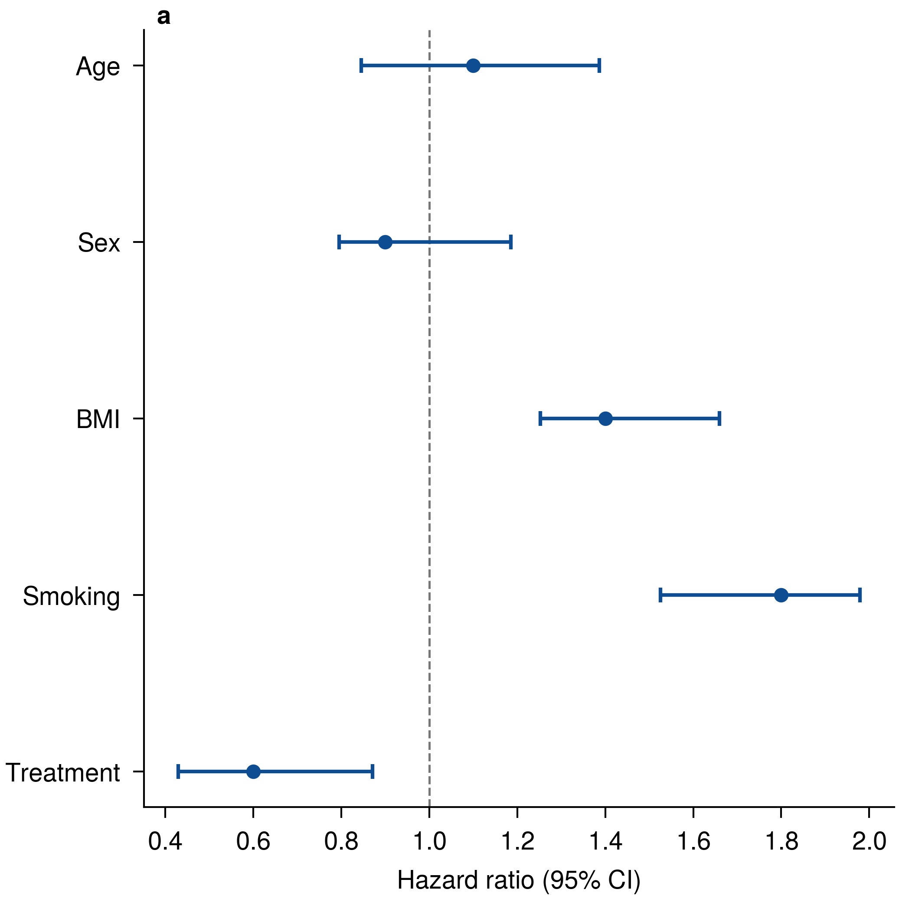
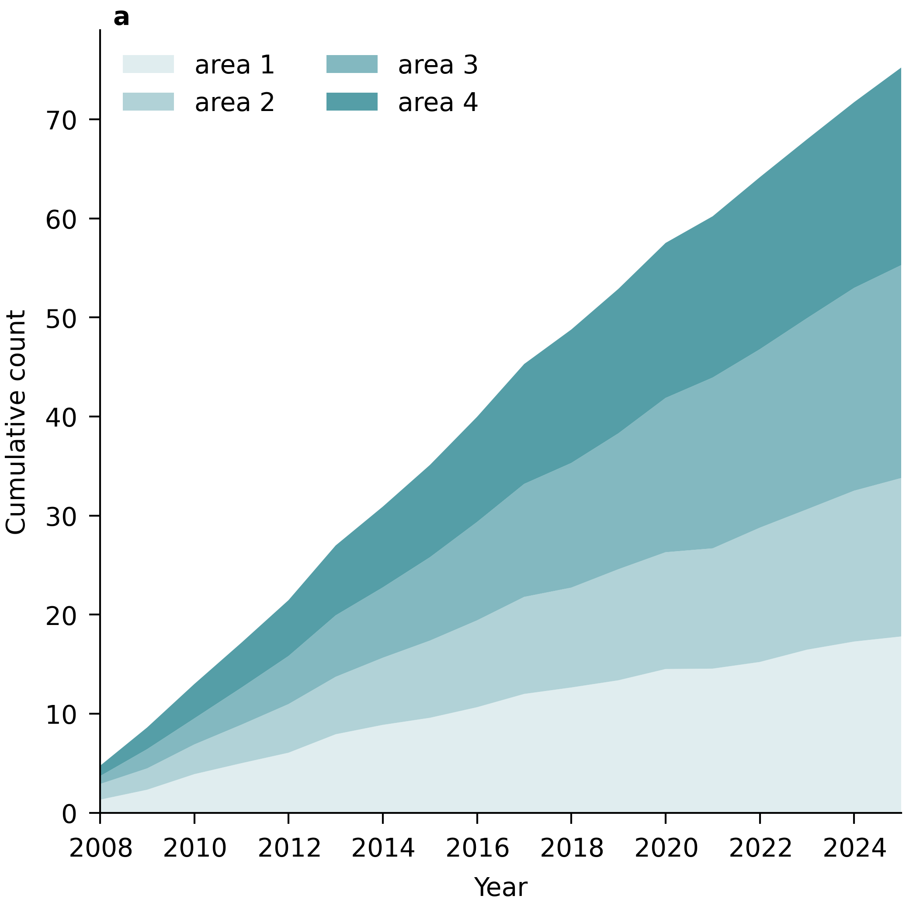

# EasyPlotLib

Matplotlib styles and helpers for publication-quality SCI-journal figures
(Nature / Science / Cell / NEJM / Lancet / PNAS / AGU / AMS).

<p align="center">
  
  
  
</p>
<p align="center"><sub>Built with the bundled <code>nature</code> style — see the full <a href="#chart-type-gallery">gallery</a>.</sub></p>

## Install

```
pip install EasyPlotLib
```

## Quick start

```python
import EasyPlotLib as epl
import matplotlib.pyplot as plt
import numpy as np

# Style + journal column width + color palette in one call.
epl.journal_style("nat1", palette="nature", nrows=1, ncols=2)

fig, axs = plt.subplots(1, 2)
x = np.linspace(0, 2 * np.pi, 200)
for n, ax in enumerate(axs):
    for k in range(3):
        ax.plot(x, np.sin(x + k), label=f"series {k}")
    ax.set_xlabel("x")
    ax.set_ylabel("amplitude")
    ax.annotate(**epl.subplot_labels(n, "a"))      # bold panel labels a, b …

# Editable vector (PDF) + 600-dpi raster.
epl.save_pub(fig, "figures/fig1", formats=("pdf", "png"))
```

## API

| Function | Description |
|----------|-------------|
| `journal_style(key, palette=, base_style=, nrows=, ncols=, apply=)` | Apply style + size + palette in one call. Returns the figsize dict. |
| `figsizes(key, ...)` | rcParams dict with a journal column figure size. Keys: `nat1/2`, `aaas1/2`, `pnas1..3`, `agu1..4`, `ams1..4`. |
| `subplot_labels(n, style)` | Args for `ax.annotate(**...)`. Styles: `a`, `A`, `(a)`, `a)`, `a.` |
| `geo_aspect(lon0, lon1, lat0, lat1)` | Display aspect (w/h) of an equal-aspect lon/lat map: `Δlon·cos(lat)/Δlat`. Feed to `row_layout` / `width_ratios`. |
| `row_layout(aspects, vmargin=)` | For a 1-row map/plot mix: derive `width_ratios` (∝ aspect → equal heights) + a safe `inverted_aspect_ratio` so every panel fills its column. |
| `clamp_colorbars(fig, (ax, cb), ...)` | Clamp each `ax=`-attached colourbar's height to its (equal-aspect) panel instead of the taller cell. |
| `set_palette(name, ax=None)` / `get_palette(name, n=)` | Set the color cycle / return raw hex list. |
| `PALETTES` | Qualitative palettes: `nature`, `science`, `nejm`, `lancet`, `jama`, `muted`, `semantic`, `nmi`, `comparison`, `imaging`, `bright`. |
| `SEMANTIC` | Role-based colors (`blue_main`=hero, `green_strong`=gain, `red_strong`=drop, `delta_up/down`, neutrals, accents). |
| `shades(color, n)` | `n` shades of one hue, light→base — related methods (e.g. a baseline trio, stacked-area family). |
| `alpha_ramp(color, n)` | One hue at graduated opacity — the standard ablation encoding. |
| `COLORMAPS` | Recommended continuous colormaps for heatmaps/images: `sequential`, `sequential_warm`, `diverging`, `grayscale`. |
| `save_pub(fig, path, formats=, dpi=)` | Save to multiple formats with editable vector text. |
| `cartopy_plot_tickmarks(ax, gl)` | Clean lon/lat tick labels for cartopy maps. |

## Color scheme guidance
Every recurring nature-style color pattern is abstracted into one small, shared
API so a whole figure stays consistent (the `examples/gallery.py` panels all
draw from it):

- **One restrained palette per figure.** Use a unified family across panels
  rather than maximizing hue variety; reduce saturation before adding categories.
- **Assign color by meaning, not by index.** `SEMANTIC` reserves `blue_main`
  for the proposed/hero method and green/red for gains/drops. Never remap the
  same method to a different hue in another panel.
- **Many-method comparison** → `get_palette("comparison")`: soft pastel
  baselines with related methods sharing a hue family, and one saturated hero
  (put your method last).
- **Related methods / one family** → `shades(color, n)`: graduated lightness of
  a single hue (baseline trios, stacked-area bands).
- **Ablations** → `alpha_ramp(color, n)`: one hue, opacity carries the ordering.
- **Continuous data** (heatmaps, density, images) → a perceptual colormap from
  `COLORMAPS` — sequential for magnitude, diverging for signed values.
- **Microscopy** → `imaging` accents (cyan/magenta) on a black background.

## Examples

[`examples/README.md`](examples/README.md) is an index of all worked examples
(chart gallery, cartopy/China maps, WRF nested-domain maps) — match your task to
a row and adapt that file rather than starting from scratch. Geoscience map
helpers and the WRF study-area figure live there too.

## Chart-type gallery
`examples/gallery.py` renders one publication-styled panel per common archetype.
Every panel sources its colors from the abstracted API above, so a method keeps
its hue across the whole figure (blue = hero, grey = baseline):

```
python examples/gallery.py   # writes PNGs to examples/gallery/
```

<table>
  <tr>
    <td align="center"><br><sub>Method comparison · <code>get_palette("comparison")</code></sub></td>
    <td align="center"><br><sub>Ablation · <code>alpha_ramp()</code></sub></td>
    <td align="center"><br><sub>Trend + CI · <code>SEMANTIC</code></sub></td>
  </tr>
  <tr>
    <td align="center"><br><sub>Heatmap · <code>COLORMAPS["sequential"]</code></sub></td>
    <td align="center"><br><sub>Scatter / bubble · <code>SEMANTIC</code></sub></td>
    <td align="center"><br><sub>Radar / polar · <code>SEMANTIC</code></sub></td>
  </tr>
  <tr>
    <td align="center"><br><sub>Violin + box · <code>shades()</code></sub></td>
    <td align="center"><br><sub>Forest / interval · <code>SEMANTIC</code></sub></td>
    <td align="center"><br><sub>Stacked area · <code>shades()</code></sub></td>
  </tr>
</table>

## Style notes

The bundled `nature` style uses 7 pt sans (TeX Gyre Heros / Helvetica), an open
frame (no top/right spines), and export settings that keep text **editable** in
Illustrator/Inkscape (`pdf.fonttype=42`, `svg.fonttype=none`) at 600 dpi.

## Claude Code skill

A personal `sci-figure` skill (`~/.claude/skills/sci-figure/`) walks Claude
through the publication workflow and is auto-invoked on plotting tasks in any
project where EasyPlotLib is installed.
