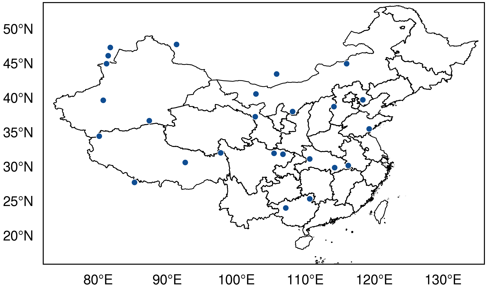
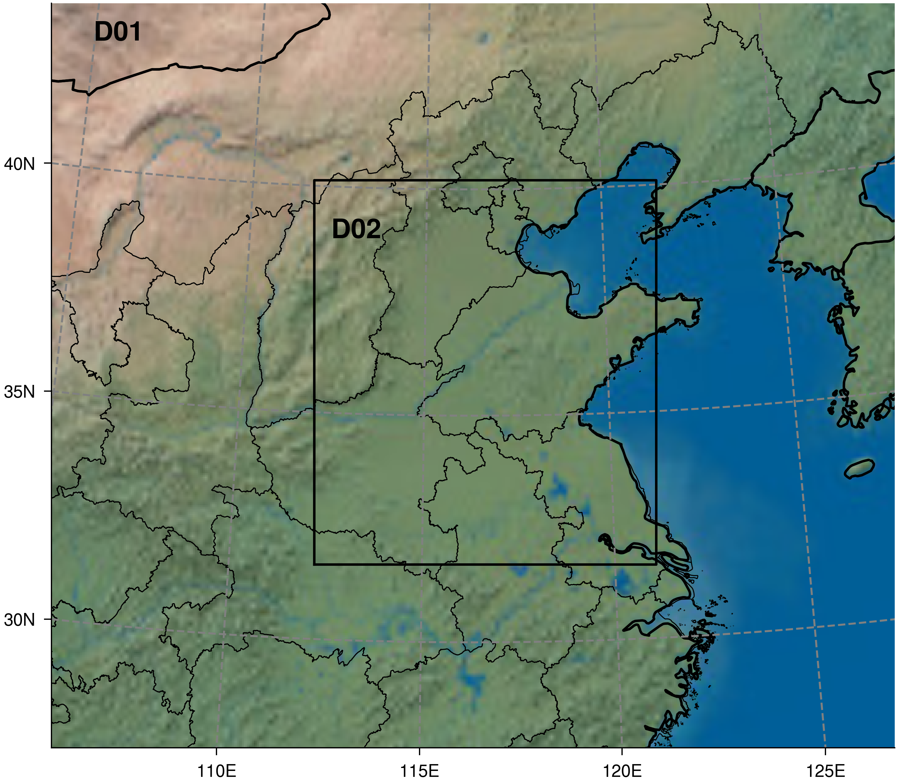

# EasyPlotLib examples — index

Worked, runnable precedents grouped by category. **Before writing a new figure,
match your task to a row below, open that file, and adapt it** — don't start from
a blank script. The `sci-figure` skill uses this index the same way.

```
examples/
├── gallery.py              charts — one publication panel per archetype
├── gallery/*.png           rendered chart panels
├── maps/                   geoscience maps (cartopy + cnmaps + salem)
│   ├── china_provinces.py      study-area map + South China Sea inset
│   ├── wrf_domain.py           WRF nested domains from namelist.wps
│   ├── wrf_field.py            WRF output field on its native CRS (cached)
│   ├── wrf_cross_section.py    WRF vertical cross section (vertcross + terrain)
│   └── data/                   namelist.wps · sample wrfout · xy_coord.pkl cache
└── layout/                 organizing multi-panel figures
    └── subplot_layouts.py      grids + mosaics, sized & labelled
```

## Charts — `gallery.py`

One publication-styled panel per archetype a manuscript usually needs; every
panel sources colour from the shared abstracted API (the reference for **colour
consistency**). Run `python examples/gallery.py` → `gallery/`.

| Want to show… | Panel | Colour API |
|---|---|---|
| compare many methods + your method | `01_bar_comparison` | `get_palette("comparison")` (hero last) |
| ablation (one method, components removed) | `02_bar_ablation` | `alpha_ramp(color, n)` |
| trend over x + uncertainty band | `03_line_trend` | `SEMANTIC` (blue=hero, grey=baseline) |
| matrix / magnitudes | `04_heatmap` | `COLORMAPS["sequential"]` |
| 2D embedding / correlation | `05_scatter_bubble` | `SEMANTIC` |
| benchmarks × few methods | `06_radar` | `SEMANTIC` |
| sample spread / distribution | `07_distributions` | `shades(color, n)` |
| effect sizes + CIs | `08_forest` | `SEMANTIC` + null rule |
| composition over time | `09_stacked_area` | `shades(color, n)` |

Shared APIs: `journal_style`, `subplot_labels`, `save_pub`. Deps: numpy, matplotlib.

## Maps — `maps/`

Geoscience base maps. **China admin boundaries always via `from cnmaps import
get_adm_maps`** (`get_adm_maps(level="省", engine="geopandas")`) — never an ad-hoc
`country.shp`. The nine-dash line (南海九段线) ships inside the province set
(cnmaps attaches the South China Sea islands to Hainan, reaching ~3.8°N), so the
**bottom-right SCS inset draws the same `china_map`**. Add geometries with
`ax.add_geometries(china_map.geometry, crs=PROJ, ...)`, which takes the CRS inline
(cnmaps returns lon/lat untagged); for salem instead call `.set_crs("EPSG:4326")`.
To colour a **gridded field** only over land, clip the mesh to one fused boundary —
`clip_pcolormesh_by_map(mesh, MapPolygon(prov.geometry.union_all()))` — and clamp the
colourbar to the drawn map height (equal-aspect maps shrink inside their grid cell)
with `epl.clamp_colorbars(fig, (ax, cb))`. For a multi-map row, size the figure
from the panels' aspects with `epl.geo_aspect` + `epl.row_layout` (see *Conventions*).

| Want… | Example | Stack | Deps |
|---|---|---|---|
| **colour-mapped field over China** (clipped to the outline) + colourbar + nine-dash-line inset | [`china_provinces.py`](maps/china_provinces.py) → [png](maps/china_provinces.png) | cartopy `pcolormesh(cmap=COLORMAPS["sequential"])` clipped via `clip_pcolormesh_by_map`; colourbar **clamped to the drawn map height** (equal-aspect maps shrink inside their cell — see `tests/test_map_aspect_colorbar.py`); `ax.inset_axes(...)` SCS inset; `cartopy_plot_tickmarks` for degree labels | cartopy, cnmaps |
| WRF nested-domain / model-config map (D01, D02 …) | [`wrf_domain.py`](maps/wrf_domain.py) → [png](maps/wrf_domain.png) | `geogrid_simulator(namelist.wps)` → salem `Grid`/`Map`, Natural-Earth bg, `cnmaps` provinces | salem, cnmaps, shapely |
| **WRF output field on its native projection** (temperature + precip) | [`wrf_field.py`](maps/wrf_field.py) → [png](maps/wrf_field.png) | extract CRS once from a `wrfout` with `salem.open_wrf_dataset(...)[["south_north","west_east"]]`, **pickle as a cache**, reload + `xy_coord.salem.cartopy()` → the projection for every `subplot_kw`; field arrays are on the native grid so `transform` IS that projection; per-panel colourbar + `gridlines(draw_labels=True)` | salem, cartopy |
| **WRF vertical cross section** (θ + circulation, RH) along a lat-lon transect | [`wrf_cross_section.py`](maps/wrf_cross_section.py) → [png](maps/wrf_cross_section.png) | `wrf.vertcross(field, z, wrfin, start_point, end_point, latlon=True)` interpolates a 3-D field onto the vertical plane, **time-averaged** over `ALL_TIMES`; `xy_loc` coord → lat/lon x-ticks; project `(ua,va)` onto the section azimuth for an in-plane wind quiver (w exaggerated) with a top-right **`quiverkey` reference arrow** labelling m/s; `interpline(ter, …)` + `fill_between` for terrain, back-filling the sub-surface NaNs so shading meets the ground; horizontal under-panel colourbars with a small `pad` (adaptive gap, see *Conventions*) | wrf-python, netCDF4 |

<p align="center">
  
  <br>
  <sub><code>china_provinces.py</code> (clipped colour field + nine-dash inset) · <code>wrf_domain.py</code> (D01 + D02 nest)</sub>
</p>

Notes: salem's `set_rgb(natural_earth="hr")` downloads on first use (and the CDN
can 406) — `"lr"` ships with salem and works offline. WRF namelists live in
[`maps/data/`](maps/data).

## Layout — `layout/subplot_layouts.py`

How to organize multi-panel figures so each panel is correctly shaped and
labelled. Two patterns, each rendered to a PNG:

| Pattern | When | Key call |
|---|---|---|
| regular grid ([`subplot_grid.png`](layout/subplot_grid.png)) | panels of equal size/role | `plt.subplots(nrows, ncols)` + matching `journal_style(nrows=, ncols=)` so each cell ≈ golden; share axes |
| irregular mosaic ([`subplot_mosaic.png`](layout/subplot_mosaic.png)) | one hero panel + supporting ones | `plt.subplot_mosaic("AAB\nAAC")` |

APIs: `journal_style`, `subplot_labels`, `save_pub`. Deps: numpy, matplotlib (no
cartopy/cnmaps).

## Conventions worth copying

- **Sizing + style in one call:** `epl.journal_style(key, base_style="nature",
  nrows=, ncols=, inverted_aspect_ratio=)`. Width keys: `nat1/2`, `aaas1/2`,
  `pnas1..3`, `agu1..4`, `ams1..4`. **Leave `ratio` alone:** it only scales the
  whole figure size (aspect unchanged) and is rarely what you want.
- **Figure aspect ≠ subplot aspect — be clear which one you mean.** `journal_style`
  sizes the *whole figure*, and `inverted_aspect_ratio` (height÷width) is the
  *figure* shape. In an `nrows×ncols` grid each panel is therefore
  **`panel_aspect = figure_aspect × ncols/nrows`** (panels share the figure's height
  but split its width). So:
  - To shape **each subplot** (the usual intent), pass **`nrows=, ncols=`** and let
    EasyPlotLib back-solve the figure aspect (`golden × nrows/ncols`) that lands
    every *cell* ≈ golden. A 1×2 grid → figure aspect `0.618 × 1/2 ≈ 0.31` (wide and
    short), each panel golden. This is what `wrf_cross_section.py` does.
  - Passing **`inverted_aspect_ratio=`** instead fixes the *figure* shape directly;
    each panel then comes out `that × ncols/nrows`. A golden *figure* of two columns
    gives **portrait** panels (`0.618 × 2 ≈ 1.24`) — usually not what you want.
  - **Cell-golden ≠ plot-box-golden.** `nrows/ncols` makes the gridspec *cell*
    golden, but an under-panel colourbar + its labels eat a big chunk of that cell
    (e.g. the cross-section's plot box came out `0.41`, not `0.618`). To make the
    golden shape the **data axes itself**, add a correction pass: the decorations
    are ~fixed in height, so loop a few times growing the figure by the plot box's
    height deficit (`golden × w_ax − h_ax`) and re-drawing until it converges —
    see `wrf_cross_section.py`. (For equal-aspect *maps*, clamp the colourbar to the
    drawn map height instead — see below.)
- **A row of maps / equal-aspect panels — derive the shape, don't hand-tune it.**
  `asp = [epl.geo_aspect(lon0, lon1, lat0, lat1), …, 1.0]` (1.0 = a square panel)
  → `lay = epl.row_layout(asp)`; pass `lay["inverted_aspect_ratio"]` to
  `journal_style` and `lay["width_ratios"]` to `plt.subplots(gridspec_kw=)`. This
  makes `width_ratios` ∝ aspect (every panel the same height) and the figure tall
  enough that each panel fills its column (no inter-panel gaps). For `ax=`-attached
  colourbars on equal-aspect panels, finish with `epl.clamp_colorbars(fig, (ax,
  cb), …)` so each bar matches its panel height. (Regression: `tests/test_row_layout.py`.)
- **Colourbar gap — let `constrained_layout` adapt it, don't pad it open.**
  `fig.colorbar`'s `pad` is a *fraction of the panel*, so matplotlib's horizontal
  default (`~0.15`) blows the gap open on a tall panel (and the gap drifts with
  figure size). Keep `pad` small (`~0.03–0.05`) and let `constrained_layout` drop
  the bar just past the tick labels — it measures their extent automatically, which
  is the adaptive behaviour; set bar thickness with `aspect=` (higher = thinner).
  Reach for a manual `fig.canvas.draw()` → `set_layout_engine("none")` → reposition
  by `get_position()` only for a pixel-constant gap or to clamp a bar to a shrunken
  equal-aspect map (see `china_provinces.py`, `clamp_colorbars`). Worked example:
  [`wrf_cross_section.py`](maps/wrf_cross_section.py).
- **Colour by meaning, not index** — `SEMANTIC` (blue=hero, grey=baseline); one
  restrained palette per figure. See `gallery.py` + root README "Color scheme".
- **Panel labels:** `ax.annotate(**epl.subplot_labels(n, "a"))` (8 pt bold).
- **Export:** `epl.save_pub(fig, path, formats=("pdf", "png"))` — editable vector
  text + 600-dpi raster. (`*.pdf` under `examples/` is gitignored.)
